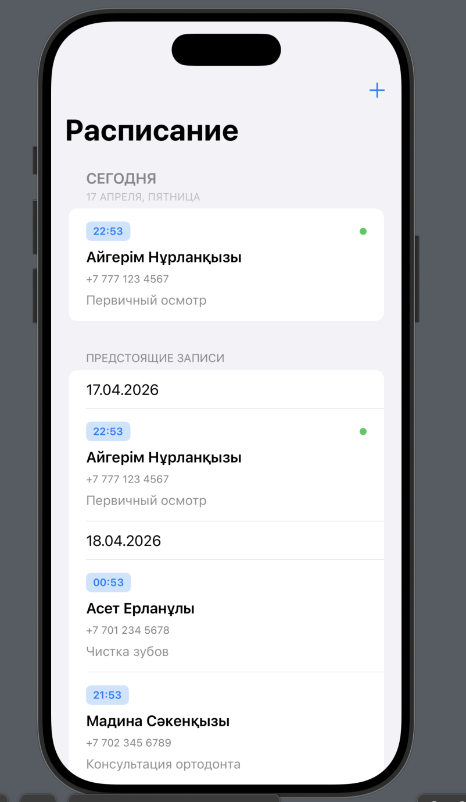
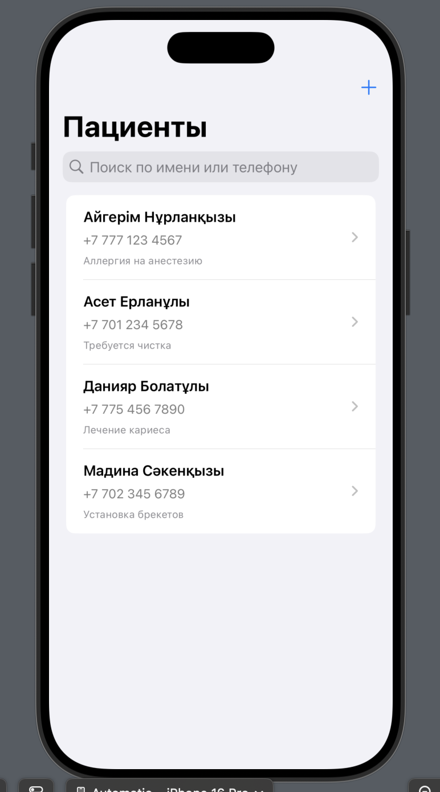
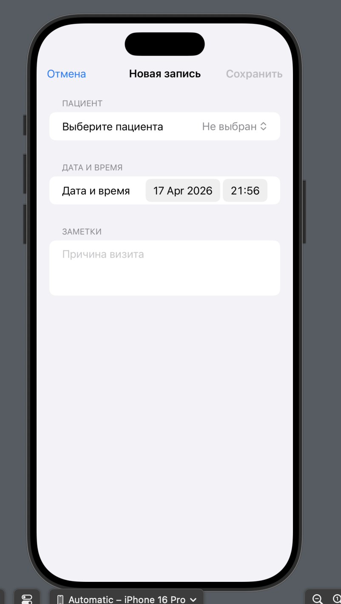
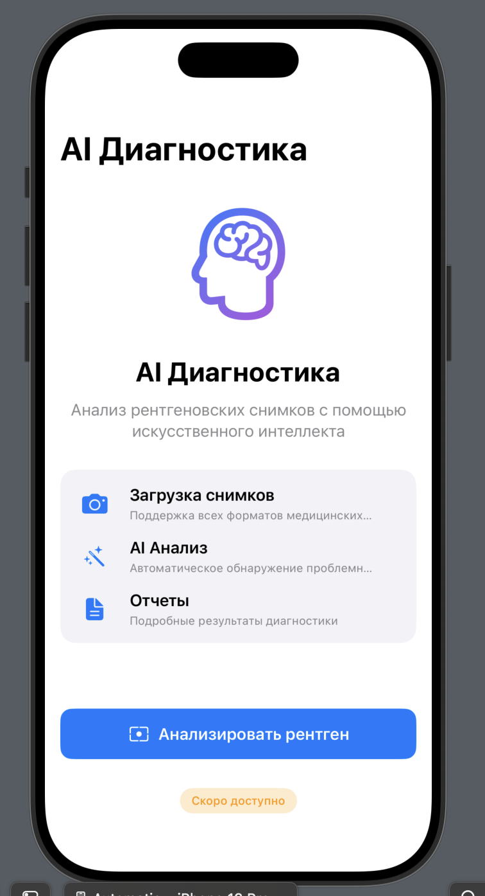

# Dental X - Dental Clinic Management System

<p align="center">
  
  
  
  
</p>

## Overview
Dental X is a production-ready iOS MVP application for managing dental clinic operations. Built with Swift and SwiftUI using clean MVVM architecture.

## 📱 Screenshots

<p align="center">
  
  
  
  
</p>

> **Screens**: Schedule • Patient Detail • Add Appointment • AI Diagnosis

## Features

### 1. Patients Management
- View all patients in a searchable list
- Add new patients with contact information
- Edit patient details
- Delete patients
- View patient history and appointments

### 2. Appointments Scheduling
- Create appointments for patients
- View appointments by date
- Today's schedule view
- Upcoming appointments grouped by date

### 3. Schedule Screen
- View today's appointments
- See all upcoming appointments
- Quick appointment creation
- Pull-to-refresh functionality

### 4. AI Diagnosis (Placeholder)
- Placeholder screen for future AI X-ray analysis
- Professional UI showing upcoming features
- Interactive button states

### 5. Settings
- Language selection (Русский, Қазақша, English)
- Notification preferences
- Dark mode toggle
- App information
- Data management options
- Privacy policy and terms of service

## Architecture

### MVVM Pattern
```
Dental X/
├── Domain/              # Business logic and models
│   └── Models/
│       ├── Patient.swift
│       └── Appointment.swift
├── Data/                # Data management
│   ├── Services/
│   │   └── StorageService.swift
│   └── Repositories/
│       ├── PatientRepository.swift
│       └── AppointmentRepository.swift
└── Presentation/        # UI and ViewModels
    ├── Main/
    │   └── MainTabView.swift
    ├── Patients/
    │   ├── PatientsViewModel.swift
    │   ├── PatientsListView.swift
    │   ├── AddPatientView.swift
    │   └── PatientDetailView.swift
    ├── Appointments/
    │   ├── AppointmentsViewModel.swift
    │   └── AddAppointmentView.swift
    ├── Schedule/
    │   ├── ScheduleViewModel.swift
    │   └── ScheduleView.swift
    ├── AI/
    │   └── AIView.swift
    └── Settings/
        └── SettingsView.swift
```

## Technical Details

### Tech Stack
- **Language**: Swift 5.0
- **Framework**: SwiftUI
- **Architecture**: MVVM (Model-View-ViewModel)
- **Min iOS Version**: iOS 18.2+
- **Data Storage**: In-memory (ready for CoreData/Cloud integration)

### Key Components

#### Domain Layer
- **Models**: Clean data structures with business logic
- **Patient**: Identifiable, Codable, Hashable
- **Appointment**: Date-based scheduling with helper methods

#### Data Layer
- **StorageService**: Singleton service for in-memory data management
- **Repositories**: Protocol-based abstraction for data operations
- **Reactive**: Uses Combine framework for real-time updates

#### Presentation Layer
- **ViewModels**: ObservableObject classes managing state
- **Views**: SwiftUI declarative UI components
- **Navigation**: TabView-based navigation with 4 main sections

### Design Patterns Used
1. **MVVM**: Separation of concerns
2. **Repository Pattern**: Data abstraction
3. **Singleton**: Shared storage service
4. **Observer Pattern**: Reactive UI updates with Combine
5. **Dependency Injection**: Testable architecture

### Code Quality
- ✅ Clean, readable code with comments
- ✅ Protocol-oriented design
- ✅ Type-safe implementations
- ✅ SwiftUI best practices
- ✅ Dark mode support
- ✅ Localized strings (Russian language)

## Sample Data

The app comes with pre-loaded sample data:
- 4 sample patients with Kazakh/Russian names
- 4 sample appointments
- Realistic clinic scenarios

## Building and Running

### Requirements
- Xcode 16.2+
- macOS with Apple Silicon or Intel
- iOS Simulator or physical device (iOS 18.2+)

### Steps
1. Open `Dental X.xcodeproj` in Xcode
2. Select a simulator or device
3. Press ⌘R to build and run

### Build Command
```bash
xcodebuild -project "Dental X.xcodeproj" \
  -scheme "Dental X" \
  -configuration Debug \
  -sdk iphonesimulator \
  build
```

## Features by Module

### Patients Module
- **PatientsListView**: Main list with search functionality
- **AddPatientView**: Form for creating new patients
- **PatientDetailView**: Detailed patient information with appointments
- **EditPatientView**: Update patient information

### Schedule Module
- **ScheduleView**: Today's appointments + upcoming schedule
- **Grouped by date**: Easy navigation through appointments
- **Real-time updates**: Automatic refresh when data changes

### AI Module
- **Placeholder UI**: Professional coming soon screen
- **Feature highlights**: Shows planned capabilities
- **Interactive elements**: Animated icons and buttons

### Settings Module
- **Preferences**: Language, notifications, theme
- **App info**: Version, build number
- **Legal**: Privacy policy, terms of service
- **Data management**: Export, import, clear data options

## Next Steps for Production

### Immediate
1. Implement CoreData for persistent storage
2. Add real authentication system
3. Integrate backend API
4. Add unit and UI tests

### Future Features
1. **AI Integration**: Real X-ray analysis with ML models
2. **Cloud Sync**: iCloud or custom backend sync
3. **Reports**: Analytics and insights
4. **Billing**: Payment and invoice management
5. **Multi-language**: Full localization support
6. **Notifications**: Appointment reminders
7. **Export**: PDF reports generation

## Code Examples

### Creating a Patient
```swift
let patient = Patient(
    name: "Айгерім Нұрланқызы",
    phone: "+7 777 123 4567",
    note: "Регулярный клиент"
)
viewModel.addPatient(patient)
```

### Creating an Appointment
```swift
viewModel.addAppointment(
    patientId: patient.id,
    date: Date(),
    notes: "Первичный осмотр"
)
```

## Project Structure
```
Dental X/
├── Dental_XApp.swift          # App entry point
├── Domain/
│   └── Models/                # Data models
├── Data/
│   ├── Services/              # Business services
│   └── Repositories/          # Data repositories
├── Presentation/
│   ├── Main/                  # Main navigation
│   ├── Patients/              # Patient management
│   ├── Appointments/          # Appointment creation
│   ├── Schedule/              # Schedule views
│   ├── AI/                    # AI placeholder
│   └── Settings/              # App settings
└── Assets.xcassets/           # App assets
```

## License
This is an educational MVP project for dental clinic management.

## Author
Created by Nurgazy Zhangozy
Date: April 17, 2026

## Contact
- Email: support@dentalx.kz
- GitHub: [Your GitHub URL]

---

**Note**: This is an MVP (Minimum Viable Product) designed for demonstration and learning purposes. For production use, implement proper data persistence, authentication, and backend integration.
